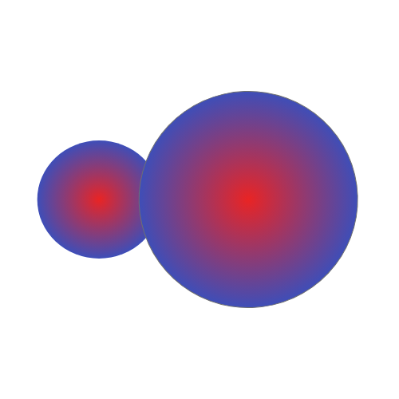
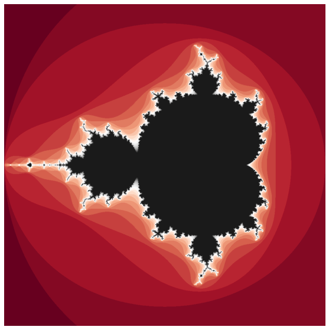
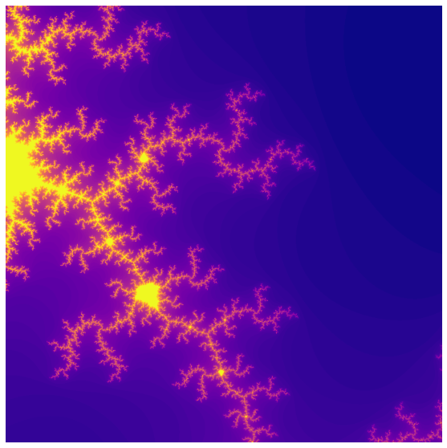
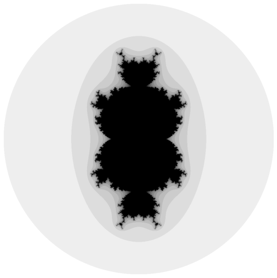
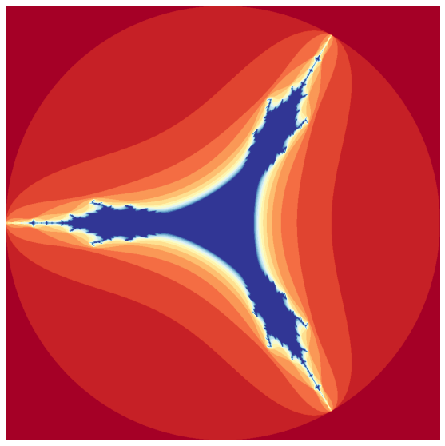
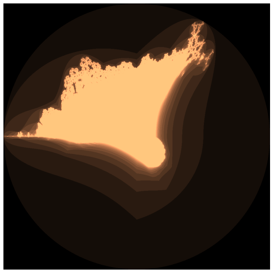
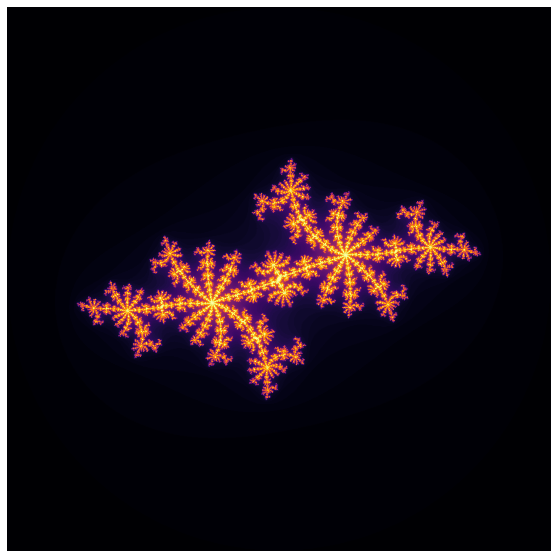
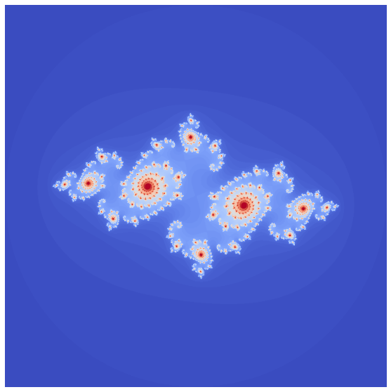

<p align="center">

</p>

# Brotground

This python package is for people who want to learn and explore the wonderful world of brots. Provides an api that allows rapid experimenting and visualization. 

```
pip install brotground
```

## Features
1. _Light weight_, well documented, easy to understand code base
2. _Extremely modular_, Replace any module with your own definition
3. _Flexible_, Comes with good defaults but can be overridden
4. _Zero Effort Setup_, Includes google colab notebooks to start experimenting without any setup
5. _Minimal Dependency_, Numba for iteration and Matplotlib for rendering

##  Overview
Brots are generalization of Mandelbrot that takes a generic Mandelbrot equation. This library makes every part of the Mandelbrot equation as a parameter offering extreme flexibility to override or use the default implementation.

>An equation means nothing to me unless it expresses a thought of God. — Srinivasa Ramanujan

A Standard **Mandelbrot** equation,
<p align="center">

</p>
when implemented and rendered will look like this,

```python
mandel = MandelBrot() # Initialize Mandelbrot
matplot_renderer = MatplotJupyterRenderer() # Initialize the renderer

mandel.iterate_diverge(max_iterations=25) # Run the iterate diverge loop
matplot_renderer.plot(mandel, cmap="RdGy") # Plot the results
```
<p align="center">

</p>

We can further zoom in on the coordinates and iterate-diverge on those coordinates,

```python
mandel.set_boundaries((-0.02, 0.02), (0.780, 0.820)) # Zoom in on the coordinates
mandel.iterate_diverge(max_iterations=100)
matplot_renderer.plot(mandel, cmap="plasma")
```

will render like below,
<p align="center">

</p>


By changing each part of the equation you can get a range of generation.
Generalizing the above Mandelbrot equation to k, we get **Multibrot** where,

<p align="center">

</p>

For a K value of 3 we get a Multibrot rendered like this, 

```python
multi = MultiBrot()

multi.iterate_diverge(max_iterations=15)
matplot_renderer.plot(multi, cmap="binary")
```

<p align="center">

</p>

A **Tricorn** brot is expressed as,  

<p align="center">

</p>

```python
tricorn = UserBrot(brot_equation=tricorn_brot_equation)

tricorn.iterate_diverge(max_iterations=15)
matplot_renderer.plot(tricorn, cmap="RdYlBu")
```

<p align="center">

</p>


A **Burning ship** brot is expressed as,  
<p align="center">

</p>

```python
burning_ship = UserBrot(brot_equation=burning_ship_brot_equation)

burning_ship.iterate_diverge(max_iterations=15)
matplot_renderer.plot(burning_ship, cmap="copper")
```

<p align="center">

</p>

**JuliaBrot** is an extension to Mandelbrot, in which instead of initializing Z and C as 0 and `complex(i, j)` respectively we initialize Z as `complex(i, j)` and C as a function `f(i, j)` based on the julia set that we want to generate.

For example, to generate a `` julia set we initialize C as `complex(-0.7, 0.35)` and this generates the following,

```python
julia = JuliaBrot(julia_name="frost_fractal")
julia.iterate_diverge(max_iterations=100)

matplot_renderer.plot(julia, cmap="inferno")
```

<p align="center">

</p>

```python
julia = JuliaBrot(julia_name="galaxiex_fractal")
julia.iterate_diverge(max_iterations=100)

matplot_renderer.plot(julia, cmap="inferno")
```

<p align="center">

</p>


